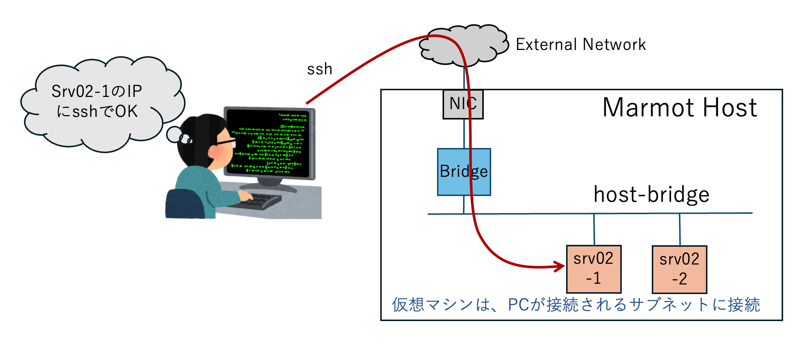

## ホストネットワークにブリッジ接続する仮想サーバー

ネットワーク host-birdgeを、仮想サーバーのマニフェストに指定すると、
marmotホストのネットワークにブリッジされたネットワークに、仮想サーバーが繋がります。

IPアドレス、デフォルトゲートウェイ、DNSサーバーなどをマニフェストで指定することで、
パソコンが繋がるネットワーク上にサーバーが起動することになります。



## VMにログインするためのキーを生成

仮想サーバーを作成する前に、SSHキーを作成しておくと便利です。

```bash
$ ssh-keygen -t ed25519 -C "For marmot VMs" -N ""
Generating public/private ed25519 key pair.
Enter file in which to save the key (/home/ubuntu/.ssh/id_ed25519): 
/home/ubuntu/.ssh/id_ed25519 already exists.
Overwrite (y/n)? 

$ cat ~/.ssh/id_ed25519.pub 
ssh-ed25519 AAAAC3NzaC1lZDI1NTE5AAAAIP6CPvNHHeF8rHScC7vrq7HMqTPQJcl08atMSqHk/gSy For marmot VMs
```


## ブリッジ接続する仮想サーバー ３種のマニフェスト

- srv02-1.yaml ホスト・ブリッジ接続の仮想サーバー、IPアドレス自動割り当て ED25519公開鍵利用
- srv02-2.yaml ホスト・ブリッジ接続の仮想サーバー、IPアドレス自動割り当て RSA公開鍵利用
- srv02-3.yaml ブリッジ接続する仮想サーバー、IPアドレス手動設定
- srv02-4.yaml ホスト・ブリッジ接続の仮想サーバー、IPアドレス自動割り当て GitHub 公開鍵利用


## 仮想サーバーの起動とログイン_１  ED25519/RSA鍵使用

デフォルトユーザーは`ubuntu`です。このフォルダーに置いてある ED25519 または RSA 鍵を使用した例です。

```bash
$ mactl create -f srv02-1.yaml 
リソースの作成要求が受け入れられました。ID: 42c2b

$ mactl get server srv02-1
NAME             NODE          STATUS        CPU  RAM(MB)  IP-ADDRESS       NETWORK          AGE
----             ----          ------        ---  -------  ----------       -------          ---
srv02-1          hv0           RUNNING       1    1024     192.168.1.175    host-bridge      27s

$ mactl ssh -i ./id_ed25519 ubuntu@srv02-1
Welcome to Ubuntu 24.04.4 LTS (GNU/Linux 6.8.0-137-generic x86_64)
```

RSA鍵の場合
```bash
$ mactl ssh -i id_rsa srv02-2
Welcome to Ubuntu 24.04.4 LTS (GNU/Linux 6.8.0-137-generic x86_64)
```

サーバーの削除
```bash
$ mactl delete server srv02-1
```

## 仮想サーバーの起動とログイン  ED25519鍵使用とIPアドレスをマニュアル設定


```bash
$ mactl create -f srv02-3.yaml

$ mactl get srv srv02-3
NAME             NODE          STATUS        CPU  RAM(MB)  IP-ADDRESS       NETWORK          AGE
----             ----          ------        ---  -------  ----------       -------          ---
srv02-3          hv0           RUNNING       1    1024     192.168.1.52     host-bridge      2m

$ mactl ssh -i ./id_ed25519 srv02-3
```

削除
```bash
$ mactl delete server srv02-3
```

## ホスト・ブリッジ接続の仮想サーバー、IPアドレス自動割り当て GitHub 公開鍵利用

GitHubで公開しているご自身のSSH鍵を使用するケースです。
ホームディレクトリの .ssh に秘密鍵があり、コマンドの引数で指定しなくても、ログインできる例です。

```bash
$ mactl create -f srv02-4.yaml 
リソースの作成要求が受け入れられました。ID: 6f73a

$ mactl get server srv02-4
NAME             NODE          STATUS        CPU  RAM(MB)  IP-ADDRESS       NETWORK          AGE
----             ----          ------        ---  -------  ----------       -------          ---
srv02-4          hv0           RUNNING       1    1024     192.168.1.182    host-bridge      2m

$ mactl ssh srv02-4
Welcome to Ubuntu 24.04.4 LTS (GNU/Linux 6.8.0-137-generic x86_64)
```

削除
```bash
$ mactl delete server srv02-4
```


