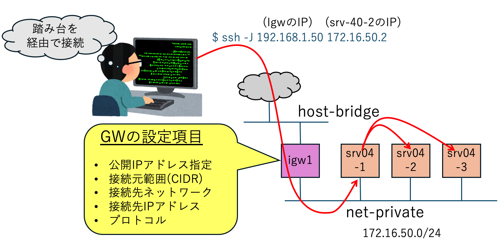

# プライベートネットワークのサーバーとゲートウェイ接続

外部からのアクセスできないプライベートなネットワークに、複数の仮想サーバーを起動できます。
そして、外部のネットワークから、プライベート・ネットワーク上の仮想サーバーへアクセスするための
ゲートウェイを起動することができます。




## プロビジョニング

最初にプライベートネットワークを作成します。
```bash
$ mactl get net
NAME            NODE       BRIDGE        STATUS        AGE       IP-NET        
----            ---------  -----------   ----------    ---       --------------
host-bridge     mh5        br0           ACTIVE        1d        -             
mgmt            mh5        br-int        ACTIVE        1d        10.245.0.0/16 
```

プライベートネットワーク `net-private` を作成するマニフェストを適用します。
```bash
$ mactl create -f network.yaml 
リソースの作成要求が受け入れられました。ID: 53e42
```

以下の様に、プライベートネットワーク `net-private` が作成されました。
```bash
$ mactl get net
NAME            NODE       BRIDGE        STATUS        AGE       IP-NET        
----            ---------  -----------   ----------    ---       --------------
host-bridge     mh5        br0           ACTIVE        1d        -             
mgmt            mh5        br-int        ACTIVE        1d        10.245.0.0/16 
net-private     mh5        br-53e42      ACTIVE        4s        172.16.50.0/24
```

次に仮想サーバーをデプロイします。
```bash
$ mactl create -f servers.yaml 
リソースの作成要求が受け入れられました。ID: a6b9c
リソースの作成要求が受け入れられました。ID: 2b40a
リソースの作成要求が受け入れられました。ID: 4a9db
```

起動した仮想サーバーを確認します。
```bash
$ mactl get server
NAME             NODE          STATUS        CPU  RAM(MB)  IP-ADDRESS       NETWORK          AGE
----             ----          ------        ---  -------  ----------       -------          ---
srv04-1          mh5           RUNNING       1    1024     172.16.50.4      net-private      35s
srv04-2          mh5           RUNNING       1    1024     172.16.50.2      net-private      35s
srv04-3          mh5           RUNNING       1    1024     172.16.50.3      net-private      35s
```

ゲートウェイを起動します。このゲートウェイは、`srv04-1`に`host-birdge`からアクセスするためのIPアドレスを付与します。

```bash
$ mactl create -f gateway.yaml 
リソースの作成要求が受け入れられました。ID: ecfd5
```

約１分でプロビジョニングが完了しました。
```bash
$ mactl get gw
NAME            INTERNAL-NET    PUBLIC-IP         STATUS        AGE     
----            ------------    ---------         ------        ---     
igw1            net-private     192.168.1.180     ACTIVE        1m  
```

```bash
ubuntu@mh5:~/marmot-manifests/04_server-on-private-network$ ssh 192.168.1.180
Welcome to Ubuntu 24.04.5 LTS (GNU/Linux 6.8.0-139-generic x86_64)

 * Documentation:  https://help.ubuntu.com
 * Management:     https://landscape.canonical.com
 * Support:        https://ubuntu.com/pro

 System information as of Wed Sep 23 07:06:03 UTC 2026

  System load: 0.08               Memory usage: 17%   Processes:       128
  Usage of /:  11.1% of 14.46GB   Swap usage:   0%    Users logged in: 0

Expanded Security Maintenance for Applications is not enabled.

0 updates can be applied immediately.

Enable ESM Apps to receive additional future security updates.
See https://ubuntu.com/esm or run: sudo pro status


The list of available updates is more than a week old.
To check for new updates run: sudo apt update


The programs included with the Ubuntu system are free software;
the exact distribution terms for each program are described in the
individual files in /usr/share/doc/*/copyright.

Ubuntu comes with ABSOLUTELY NO WARRANTY, to the extent permitted by
applicable law.

ubuntu@srv04-1:~$ hostname
srv04-1
```


踏み台サーバー経由で、プライベートネットワークのサーバーにアクセスするには、`ssh -J 踏み台IP ターゲットIP`とします。
```bash
$ ssh -J 192.168.1.180 172.16.50.2
Welcome to Ubuntu 24.04.5 LTS (GNU/Linux 6.8.0-139-generic x86_64)

 * Documentation:  https://help.ubuntu.com
 * Management:     https://landscape.canonical.com
 * Support:        https://ubuntu.com/pro

 System information as of Wed Sep 23 07:33:49 UTC 2026

  System load: 0.0                Memory usage: 17%   Processes:       127
  Usage of /:  11.1% of 14.46GB   Swap usage:   0%    Users logged in: 0

Expanded Security Maintenance for Applications is not enabled.

0 updates can be applied immediately.

Enable ESM Apps to receive additional future security updates.
See https://ubuntu.com/esm or run: sudo pro status


The list of available updates is more than a week old.
To check for new updates run: sudo apt update


The programs included with the Ubuntu system are free software;
the exact distribution terms for each program are described in the
individual files in /usr/share/doc/*/copyright.

Ubuntu comes with ABSOLUTELY NO WARRANTY, to the extent permitted by
applicable law.

ubuntu@srv04-2:~$ hostname
srv04-2
```