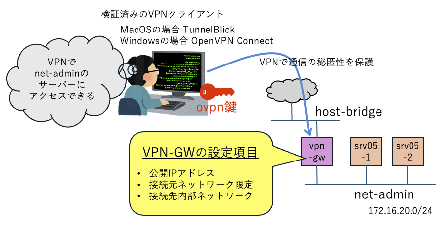

## PCからVPN クライアント経由で、marmot内部のプライベートネットワークへ接続する

外部ネットワークからMarmotのプライベートネットワークに、OpenVPNを利用してアクセスする方法を提供します。
これを実現するには、`VpnGateway`を利用します。




#### 管理用ネットワークをデプロイ

```console
$ mactl create -f net-admin.yaml 
リソースの作成要求が受け入れられました。ID: 6d6f4

$ mactl get -f net-admin.yaml 
NAME            NODE       BRIDGE        STATUS        AGE       IP-NET        
----            ---------  -----------   ----------    ---       --------------
net-admin       mh5        br-6d6f4      ACTIVE        2s        172.16.20.0/24

```

#### 管理対象サーバーをデプロイ

```console
$ mactl create -f srv05.yaml 
リソースの作成要求が受け入れられました。ID: de775
リソースの作成要求が受け入れられました。ID: ff6fc

$ mactl get server
NAME             NODE          STATUS        CPU  RAM(MB)  IP-ADDRESS       NETWORK          AGE
----             ----          ------        ---  -------  ----------       -------          ---
srv05-1          mh5           RUNNING       1    1024     172.16.20.2      net-admin        19s
srv05-2          mh5           RUNNING       1    1024     172.16.20.3      net-admin        19s
```

#### VPNゲートウェイをデプロイ

```console
$ mactl create -f vpn-gw.yaml 
リソースの作成要求が受け入れられました。ID: 9039c

$ mactl get vpngw
NAME            INTERNAL-NET    PUBLIC-IP         STATUS        AGE     
----            ------------    ---------         ------        ---     
vpn-gw          net-admin       192.168.1.199     ACTIVE        4m      
```

#### PCにインストールする OpenVPNクライアント

OpenVPNのクライアントであれば、どれでも良いと思います。
開発時に検証したOpenVPNクライアントは、以下の２種類です。

- MacOS: TuunelBlick (https://tunnelblick.net/)
- Windows: OpenVPN Connect (https://openvpn.net/client/)

#### アクセステスト

OpenVPNの接続ファイルをダウンロードして、OpenVPNクライアントに読み込ませます。

```console
$ mactl get vpngw vpn-gw -d
vpn profile downloaded: /home/ubuntu/marmot-manifests/04-connect-via-openvpn/vpn-gw.ovpn
```

OpenVPNで接続して、ターミナルを開いて、`ssh ubuntu@172.16.20.2` をアクセスすることで、
プライベートネットワークの仮想サーバーへ、リーチすることができます。
