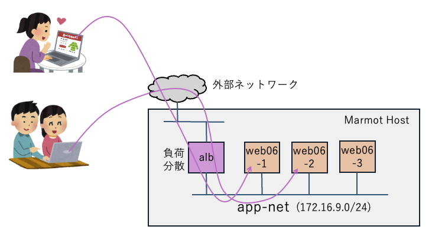
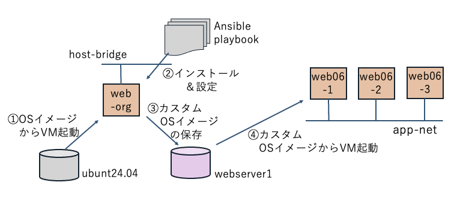

# アプリケーションロードバランサーでWebサーバーを負荷分散する

Application Load Balancer (ALB) は、HTTPのL7ロードバランサーです。
外部ネットワークからのリクエストの分配先は、Kubernetesのサービスと同様に、ALBに設定されたマッチング式とサーバーに付与されたラベルで選別されます。


同じ仕様の仮想サーバーをデプロイするために、雛形となるサーバーをAnsibleを使ってセットアップします。
このようにして完成したサーバーのカスタムイメージを保存しておきます。

カスタムイメージを利用して、同じ仕様の仮想マシンを複数起動することができます。
この様に作成された仮想マシンは、ALBによる負荷分散対象の仮想サーバーとして適しています。



## 本マニフェストでの起動手順

### 1. プライベート専用ネットワークの作成

プライベートネットワークを作成する

```console
$ mactl create -f app-net.yaml
$ mactl get net
```

### 2. イメージを作成するためのWebサーバーを作成

プライベートネットワークに接続するサーバーを起動する。
```console
$ mactl create -f web-org.yaml
$ mactl get srv
```

### 3. イメージを作成
```console
$ mactl describe server web-org
$ mactl server createimage <ID> webserver1
$ mactl get image
```

### 4. Webサーバーをデプロイ
```console
$ mactl create -f webs.yaml
$ mactl get server -l app=web3
```

### 3. ロードバランサーの起動

```console
$ mactl create -f alb.yaml
$ mactl get alb
```
起動と設定が完了して、動作を開始するまでに、約１分くらい時間が必要です。


