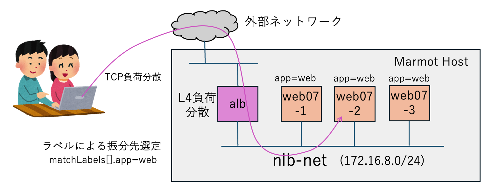

# ネットワークロードバランサーでサービスを負荷分散する

Network LoadBalancer は、内部ネットワーク上のサーバー群をラベル選択し、1つ以上の Listener でIP で振り分けるL4ロードバランサー機能です。




## 本マニフェストでの起動手順

### 1. プライベート専用ネットワークの作成

プライベートネットワークを作成する

```console
$ mactl create -f nlb-net.yaml
$ mactl get net
```

### 2. イメージを作成するためのWebサーバーを作成

プライベートネットワークに接続するサーバーを起動する。
```console
$ mactl create -f web.yaml
$ mactl get srv
```

### 3. イメージを作成
Ansibleでセットアップされたアプリケーションを含む仮想マシンイメージを、webserver2 として保存します。
```console
$ mactl describe server web07-0
$ mactl server createimage <ID> webserver2
$ mactl get image
```

### 4. Webサーバーをデプロイ
先のステップで、保存された仮想マシンイメージを利用した仮想サーバーを起動します。
```console
$ mactl create -f webs.yaml
$ mactl get server -l app=web
```

### 5. ロードバランサーの起動
NLB(L4ロードバランサー)を起動します。
```console
$ mactl create -f nlb.yaml
$ mactl get nlb
```
起動と設定が完了して、動作を開始するまでに、約１分くらい時間が必要です。

### 6. ブラウザでアクセス

次のコマンドで表示された`PUBLIC-IP`を使って、ブラウザからアクセスします。
```
ubuntu@mh5:~$ mactl get nlb
NAME              INTERNAL-NET    PUBLIC-IP         STATUS        LISTENERS  AGE     
----              ------------    ---------         ------        ---------  ---     
nlb1              nlb-net         192.168.1.72      ACTIVE        1          33m     
```

ブラウザで連続してリロードすると、セッションが再利用されて、バックエンドサーバーが切り替わらないので、少し時間をおいてからリロードします。`curl`コマンドを利用する時は、コマンドが終了するとともにセッションが切れますから、より負荷分散の状況が解りやすいと思います。
