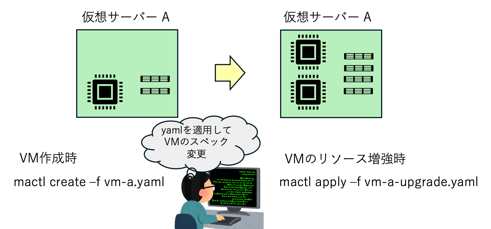

# サーバーの変更

ラベルとコメントを変更できます。また、CPUとメモリも条件付きで変更できます。

仮想マシンとして、CPU、メモリの量を変更することができます。制限をかけていません。
ハードウェアのリソース量を超えるCPUとメモリ量をセットすることもできます。
また、OSが起動できないメモリ量に減らすことも可能です。



## 注意　
- CPUやメモリを変更する際に、再起動が実施されます。
- NIC、ディスクの増設、撤去は実施できません。必要な時は、サーバーを再作成してください。


## サーバーのデプロイ
```console
$ mactl create -f srv08-cpu-x1.yaml 
リソースの作成要求が受け入れられました。ID: 37341

$ mactl get server
NAME             NODE          STATUS        CPU  RAM(MB)  IP-ADDRESS       NETWORK          AGE
----             ----          ------        ---  -------  ----------       -------          ---
srv08            mh5           RUNNING       1    1024     192.168.1.207    host-bridge      17s
```

## CPUの増設
```console
$ mactl apply -f srv08-cpu-x2.yaml 
Warning: server srv08 will be stopped and restarted to apply changes. Continue? [y/N]: y
リソースが更新されました。ID: be616

$ mactl get server srv08
NAME             NODE          STATUS        CPU  RAM(MB)  IP-ADDRESS       NETWORK          AGE
----             ----          ------        ---  -------  ----------       -------          ---
srv08            mh5           RUNNING       2    1024     192.168.1.207    host-bridge      1m
```
仮想マシンの再起動が完了すると、ログインできる様になります。

```console
$ mactl ssh srv08
Welcome to Ubuntu 24.04.5 LTS (GNU/Linux 6.8.0-139-generic x86_64)
＜中略＞

$ lscpu
Architecture:                x86_64
  CPU op-mode(s):            32-bit, 64-bit
  Address sizes:             48 bits physical, 48 bits virtual
  Byte Order:                Little Endian
CPU(s):                      2
  On-line CPU(s) list:       0,1
Vendor ID:                   AuthenticAMD
```

## CPUの削減

```console
$ mactl get server srv08
NAME             NODE          STATUS        CPU  RAM(MB)  IP-ADDRESS       NETWORK          AGE
----             ----          ------        ---  -------  ----------       -------          ---
srv08            mh5           RUNNING       2    1024     192.168.1.207    host-bridge      5m

$ mactl apply -f srv08-cpu-x1.yaml 
Warning: server srv08 will be stopped and restarted to apply changes. Continue? [y/N]: y
リソースが更新されました。ID: be616

$ mactl get server srv08
NAME             NODE          STATUS        CPU  RAM(MB)  IP-ADDRESS       NETWORK          AGE
----             ----          ------        ---  -------  ----------       -------          ---
srv08            mh5           RUNNING       1    1024     192.168.1.207    host-bridge      5m
```

```console
$ mactl ssh srv08
Welcome to Ubuntu 24.04.5 LTS (GNU/Linux 6.8.0-139-generic x86_64)
＜中略＞

$ lscpu
Architecture:                x86_64
  CPU op-mode(s):            32-bit, 64-bit
  Address sizes:             48 bits physical, 48 bits virtual
  Byte Order:                Little Endian
CPU(s):                      1
  On-line CPU(s) list:       0
＜中略＞
```

## メモリ量の増加

メモリ１Gの仮想マシンを２Gに増設します。
```console
$ mactl ssh srv08
Welcome to Ubuntu 24.04.5 LTS (GNU/Linux 6.8.0-139-generic x86_64)
＜中略＞

$ free -h
               total        used        free      shared  buff/cache   available
Mem:           961Mi       298Mi       605Mi       1.0Mi       199Mi       662Mi
Swap:             0B          0B          0B
```

メモリを２Gに増設後に、ログインして確認してみます。
```console
$ mactl apply -f srv08-ram-x2.yaml 
Warning: server srv08 will be stopped and restarted to apply changes. Continue? [y/N]: y
リソースが更新されました。ID: 369dd

$ mactl ssh srv08
Welcome to Ubuntu 24.04.5 LTS (GNU/Linux 6.8.0-139-generic x86_64)
 ＜中略＞

$ free -h
               total        used        free      shared  buff/cache   available
Mem:           1.9Gi       302Mi       1.6Gi       1.0Mi       205Mi       1.6Gi
Swap:             0B          0B          0B
```

## ラベルの付与

ラベルが設定されたYAMLファイルを `mactl apply`で適用することで、ラベルの変更ができます。

```console
$ mactl get server srv08 -o json |jq .[].metadata.labels
null

$ mactl apply -f srv08-change-labels-comment.yaml 
リソースが更新されました。ID: 369dd

$ mactl get server srv08 -o json |jq .[].metadata.labels
{
  "env": "test"
}
```
