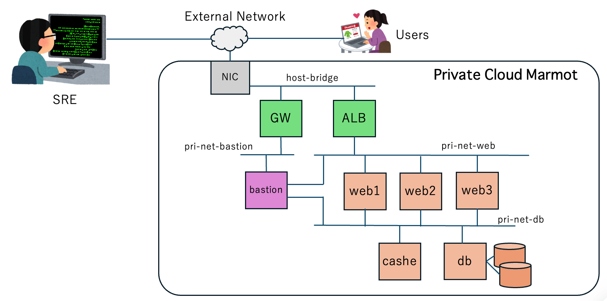

# プライベートネットワークに繋がったサーバー

プライベートクラウド Marmot 上で、図の様なシステム構成を構築することができます。

## 構成について



このシステムには、以下のネットワークがあります。
- `host-bridge`は、MarmotのPCが接続されたネットワークで、このネットワークまでが外部ネットワークといえます。
- `pri-net-bastion`は、踏み台サーバーへの経路で、開発や保守のために使用できるセキュアな経路です。
- `pri-net-web`は、Webサーバーのアプリケーションにアクセスするためのプライベートアドレスの経路です。
- `pri-net-db`は、Webサーバーのアプリケーションがデータベースやキャッシュにアクセスするための経路です。

外部からの入り口は、GW(ゲートウェイ）とALB(アプリケーションロードバランサー)の二つです。
- `GW`は、アクセス元範囲を限定できるゲートウェイ機能で、この構成では`GW`が公開するIPアドレスにアクセスすると、`bastion`踏み台サーバーにログインできます。これを踏み台として、WebサーバーやDBサーバなどにアクセスできます。
- `ALB`は、HTTPを負荷分散するためのL7ロードバランサーで、HTTPセッションを補足して、振り先サーバーを固定する機能を有しています。

web1〜web3サーバーは、Webアプリケーションサーバーであり、host-bridgeより向こう側の外部ネットワークからの攻撃は、ALB,GWによって遮断される形となります。web1〜web3サーバーは、`pri-net-db`で経由して、データベースやキャッシュへアクセスすることができます。

dbサーバーは、bastionやweb1〜web3の背後にあるプライベートネットワーク`pri-net-db`に接続されるサーバーで外部からは容易に侵入できない深部に配置されています。dbサーバーは、データ領域としてLVMで作成された拡張ディスクを２本持っています。


## 構築手順

### プライベートネットワークの構築

```console
$ mactl create -f pri-networks.yaml
$ mactl get network -l case=30
```

### 仮想サーバーの起動

```console
$ mactl create -f servers.yaml
$ mactl get servers -l case=30
```

### ロードバランサーとゲートウェイの起動

```console
$ mactl create -f gateways
$ mactl get alb
$ mactl get gw
```


## サーバーへのログイン

```console
$ mactl get gw
NAME            INTERNAL-NET    PUBLIC-IP         STATUS        AGE     
----            ------------    ---------         ------        ---     
gw30            pri-net-bastion  192.168.1.181     ACTIVE        3m

$ mactl get server -l case=30
NAME             NODE          STATUS        CPU  RAM(MB)  IP-ADDRESS       NETWORK          AGE
----             ----          ------        ---  -------  ----------       -------          ---
srv30-bastion    mh5           RUNNING       1    1024     172.16.90.2      pri-net-bastion  4m
                                                           10.120.1.3       pri-net-web      
                                                           10.120.10.4      pri-net-db       
srv30-cache      mh5           RUNNING       1    1024     10.120.10.3      pri-net-db       4m
srv30-db         mh5           RUNNING       1    1024     10.120.10.7      pri-net-db       4m
srv30-w1         mh5           RUNNING       1    1024     10.120.1.2       pri-net-web      4m
                                                           10.120.10.2      pri-net-db       
srv30-w2         mh5           RUNNING       1    1024     10.120.1.4       pri-net-web      4m
                                                           10.120.10.5      pri-net-db       
srv30-w3         mh5           RUNNING       1    1024     10.120.1.5       pri-net-web      4m
                                                           10.120.10.6      pri-net-db     
$ ssh -J 192.168.1.181 10.120.1.2
Welcome to Ubuntu 24.04.5 LTS (GNU/Linux 6.8.0-139-generic x86_64)
＜中略＞

ubuntu@srv30-w1:~$ hostname
srv30-w1

ubuntu@srv30-w1:~$ sudo apt-get update
Get:1 http://security.ubuntu.com/ubuntu noble-security InRelease [126 kB]
Hit:2 http://archive.ubuntu.com/ubuntu noble InRelease
＜中略＞
Fetched 37.3 MB in 5s (7815 kB/s)                
Reading package lists... Done

ubuntu@srv30-w1:~$ curl ifconfig.io
curl: (6) Could not resolve host: ifconfig.io

ubuntu@srv30-w1:~$ ip r
10.120.1.0/24 dev enp1s0 proto kernel scope link src 10.120.1.2 
10.120.10.0/24 dev enp2s0 proto kernel scope link src 10.120.10.2 
10.245.0.0/16 dev enp7s0 proto kernel scope link src 10.245.0.18 
```


## クリーンナップ
依存関係を考慮して、サーバー、ゲートウェイ、ネットワークの順番で削除します。

```console
$ mactl delete -f servers.yaml 
server "srv30-bastion" deletion requested (accepted)
server "srv30-cache" deletion requested (accepted)
server "srv30-db" deletion requested (accepted)
server "srv30-w1" deletion requested (accepted)
server "srv30-w2" deletion requested (accepted)
server "srv30-w3" deletion requested (accepted)

$ mactl delete -f gateways.yaml 
application load balancer "alb30" deletion requested (accepted)
gateway "gw30" deletion requested (accepted)

$ mactl delete -f networks.yaml 
network "pri-net-bastion" deletion requested (accepted) for 1 object(s)
network "pri-net-web" deletion requested (accepted) for 1 object(s)
network "pri-net-db" deletion requested (accepted) for 1 object(s)
```
