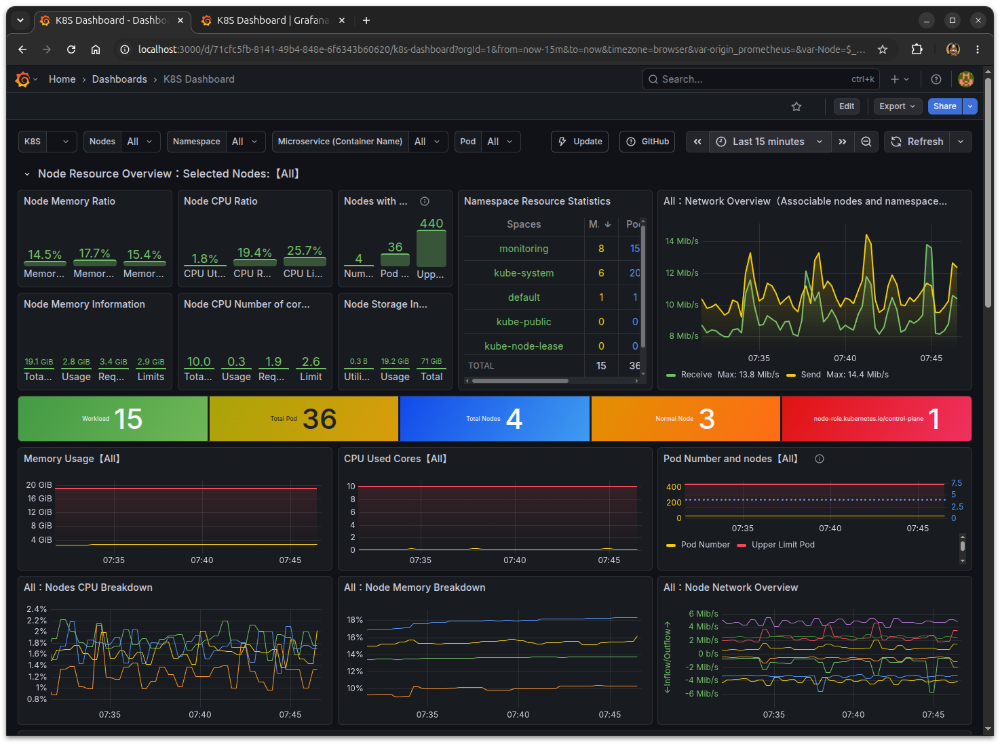

# Kubernetesクラスタの構築

marmot 上に Kubernetesクラスタを構築することができます。
以下のスクリーンショットは、Kubernetesクラスタを動かし、GrafanaとPrometheusを起動してアクセスした画面です。



## Kuberntest クラスタの起動

Kubernetesクラスタのノード間用クラスタ（ポッド）ネットワークを作成します。

```console
$ mactl get net
NAME            NODE       BRIDGE        STATUS        AGE       IP-NET        
----            ---------  -----------   ----------    ---       --------------
host-bridge     hv0        br0           ACTIVE        13m       -             
default         hv0        virbr0        ACTIVE        13m       -             

$ mactl create -f cluster-net.yaml 
リソースの作成要求が受け入れられました。ID: 7b070

$ mactl get net
NAME            NODE       BRIDGE        STATUS        AGE       IP-NET        
----            ---------  -----------   ----------    ---       --------------
host-bridge     hv0        br0           ACTIVE        20m       -             
default         hv0        virbr0        ACTIVE        20m       -             
cluster-net     hv0        br-d2f26      ACTIVE        6s        172.16.20.0/24
```

コントールプレーンとワーカーとなるノード（サーバー）を起動します。

```console
$ mactl get srv
NAME             NODE          STATUS        CPU  RAM(MB)  IP-ADDRESS       NETWORK          AGE
----             ----          ------        ---  -------  ----------       -------          ---

$ mactl create -f cluster-servers.yaml 
リソースの作成要求が受け入れられました。ID: dc384
リソースの作成要求が受け入れられました。ID: bcded
リソースの作成要求が受け入れられました。ID: b42c7
リソースの作成要求が受け入れられました。ID: f0d6f

$ mactl get server
NAME             NODE          STATUS        CPU  RAM(MB)  IP-ADDRESS       NETWORK          AGE
----             ----          ------        ---  -------  ----------       -------          ---
master           hv0           PROVISIONING  4    8192     192.168.1.220    host-bridge      13s
                                                           172.16.20.220    cluster-net      
node1            hv0           RUNNING       2    4192     192.168.1.221    host-bridge      13s
                                                           172.16.20.221    cluster-net      
node2            hv0           RUNNING       2    4192     192.168.1.222    host-bridge      13s
                                                           172.16.20.222    cluster-net      
node3            hv0           PENDING       2    4192     192.168.1.223    host-bridge      13s
                                                           172.16.20.223    cluster-net      
```

仮想マシンのOSが起動して、Ansibleプレイブックが使用可能になったことを確認します。

```console
$ ansible -i hosts -m ping all |grep SUCC
node1 | SUCCESS => {
node2 | SUCCESS => {
master | SUCCESS => {
node3 | SUCCESS => {
```

Ansibleに必要なssh が実行できるようになったので、Kubernetesクラスタ構築用のプレイブックを適用します。

```console
$ ansible-playbook -i hosts playbooks/install.yaml 

PLAY [Linuxのセットアップとコンテナランタイムのインストール] ********************************************************

TASK [Gathering Facts] **********************************************************************************************
ok: [master]
ok: [node3]
ok: [node1]
ok: [node2]

＜中略＞

PLAY RECAP **********************************************************************************************************
master                     : ok=80   changed=52   unreachable=0    failed=0    skipped=4    rescued=0    ignored=0   
node1                      : ok=63   changed=40   unreachable=0    failed=0    skipped=4    rescued=0    ignored=0   
node2                      : ok=63   changed=40   unreachable=0    failed=0    skipped=4    rescued=0    ignored=0   
node3                      : ok=63   changed=40   unreachable=0    failed=0    skipped=4    rescued=0    ignored=0   
```

Kubernetesクラスタのベース部分が起動したので、次にアドオンをインストールします。

```console
$ ansible-playbook -i hosts playbooks/addon.yaml 

＜中略＞

PLAY RECAP ********************************************************************************************************************************************************
master                     : ok=20   changed=15   unreachable=0    failed=0    skipped=0    rescued=0    ignored=0   
```

手元のPCに、kubectlのクライアント証明書をコピーして、 Kubernetesクラスタにアクセスできることを確認します。
```
$ scp -r 192.168.1.220:~/.kube .
$ kubectl get node
NAME     STATUS   ROLES           AGE     VERSION
master   Ready    control-plane   7m31s   v1.36.2
node1    Ready    <none>          7m20s   v1.36.2
node2    Ready    <none>          7m20s   v1.36.2
node3    Ready    <none>          7m20s   v1.36.2
```

Grafanaのパスワードを取得して、ポートをフォワードして、手元PCのブラウザでアクセスします。

```console
$ kubectl get secret --namespace default grafana -o jsonpath="{.data.admin-password}" | base64 --decode ; echo
RbIjEo6GfoTERlvYJI0zIaHcIGCKhPLo77LcbrLp

$ export POD_NAME=$(kubectl get pods --namespace default -l "app.kubernetes.io/name=grafana,app.kubernetes.io/instance=grafana" -o jsonpath="{.items[0].metadata.name}")
$ kubectl --namespace default port-forward $POD_NAME 3000
```

ブラウザから http://localhost:3000 へアクセスします。ユーザー admin, パスワードは上記の文字列をインプットしてログインします。

データソースに、プロメテウスを選択して、Connectionに `http://prometheus-k8s.monitoring.svc:9090/` をセットして[Save & Test]をクリックします。

## ダッシュボード

- 1860 ノードエクスポーター
- 8171 Kubernetes ノード
- 1621 Kubernetes クラスタモニタリング
- 747　Kubernetes Pod Metrics
- 15661 K8S Dashboard


## kubectl コマンドのインストール

```console
curl -LO "https://dl.k8s.io/release/$(curl -L -s https://dl.k8s.io/release/stable.txt)/bin/linux/amd64/kubectl"
sudo mv kubectl /usr/local/bin
sudo chmod +x /usr/local/bin/kubectl
```

