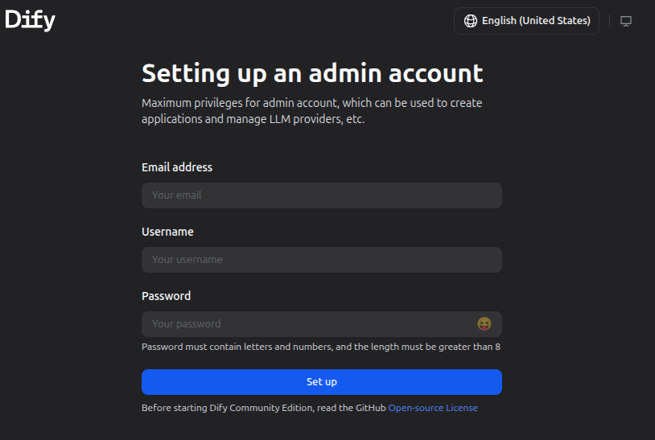

# dify サーバーの起動

difyサーバーを、docker-compose で起動します仮想サーバーです。
この手順が完了すると、以下のスクリーンショットの画面が表示されます。

```console
$ mactl create -f server-dify-2.yaml
$ ansible -i inventory_hosts all -m ping
$ ansible-playbook -i inventory_hosts playbook/setup-dify.yaml
```

ブラウザで、このリンクをクリックする
http://192.168.1.112/install


この画面が表示されます。


